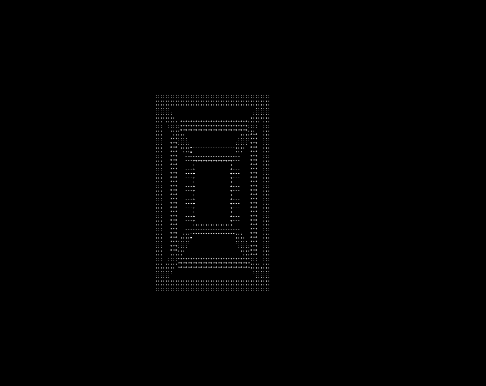

# Hello 👋, I'm John Nunes Sugahara!

## 👤 About Me:
 Software Engineering student at Inatel.
 
 Developing a 3D platform in Unity for visualizing signal propagation between Access Point (AP), User Equipment (UE), and Reconfigurable Intelligent Surfaces (RIS).
 
 Currently learning Docker and improving skills in backend and system architecture.

  

  Just a cool 4D object ~ John Nunes Sugahara

# 💻  Tech Stack:
                       
# 📊 GitHub Stats:

  

  

  

## 🏆 GitHub Trophies

---

